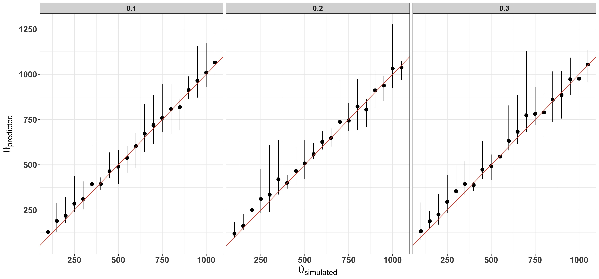
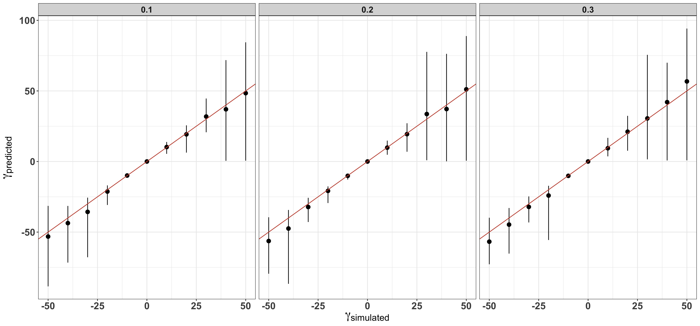

# Pipeline for testing anavar1.1 with simulated data

This repository contains scripts for simulating site frequency spectra with different distributions of fitness effects and classes of sites. 

## Required programs

* anavar1.1

## Required scripts

* snpdfe_spike_gen.withopts.m
* test_anavar1.1_1class.py

## Simple testing

A simple implementation of the model with one class of sites can be run on a set of neutral simulated SNPs with no polarisation error as follows:

```
$ python test_anavar1.1_1class.py -n 20 -t1 1000 -g1 0 -e1 0 -o /fastdata/bop15hjb/anavar_sims/1class_tests_1setsnps -H > /fastdata/bop15hjb/anavar_sims/1class_tests_1setsnps.bestlnL.txt
$
$ cat 1class_tests_1setsnps.bestlnL.txt 
run	imp	exit_code	data_1_theta_1	data_1_gamma_1	data_1_e_1	lnL	sim_theta_1	sim_gamma_1	sim_e_1
70	3	3	1055.99173407747	-0.441685579330643	0.0114752385708097	16677.7198398418	1000	0	0
```

## Multiple parameter combinations
### 1 set of SNPs, 1 class of sites

660 parameter combinations run as follows:

```
anavar_simulations/1_class_test_ranges.py -n 20 -t1_r 100,1100,50 -g1_r ' -50,60,10' -e1_r 1,4,1 -o /fastdata/bop15hjb/anavar_sims/1class_tests_1setsnps -bestlnL /fastdata/bop15hjb/anavar_sims/1class_tests_1setsnps.bestlnL.txt 
```

The resulting data was then plotted as follows:

```
rscript 1class_anavar1.1_plots.R 1class_tests_1setsnps.bestlnL.txt 
```



error plot: <1class.1snps.anavar1.1.error.jpg>

### 1 set of SNPs, 2 classes of sites

17820 parameter combinations with two site classes were run as follows:

```
anavar_simulations/2_class_test_ranges.py -n 20 -t1_r 100,1100,50 -t2_r 100,1100,450 -g1_r "' -50,60,10'" -g2_r "' -50,20,30'" -e1_r 1,4,1 -e2_r 1,4,1 -o /fastdata/bop15hjb/anavar_sims/2class_sims/2class_test_1setsnps -bestlnL /fastdata/bop15hjb/anavar_sims/2class_sims/2class_test_1setsnps.bestlnL.txt -sub
```

The resulting data was then plotted as follows:

```
rscript 2class_anavar1.1_plots.R 2class_test_1setsnps.bestlnL.txt 
```


### 1 set of SNPs, 2 class of sites, 100 replicates per combination

16 parameter combinations, each repeated 100 times were run as follows:

```
anavar_simulations/2_class_test_ranges.v2.py -n 20 -t1_r 500,1100,500 -t2_r 100,400,200 -g1_r "' -25,0,20'" -g2_r "' -10,5,10'" -e1_r 0,1,1 -e2_r 0,1,1 -nrep 100 -o /fastdata/bop15hjb/anavar_sims/2class_sims_reps/16_paramcombs -bestlnL /fastdata/bop15hjb/anavar_sims/2class_sims_reps/16_paramcombs_bestlnL.txt -sub
```